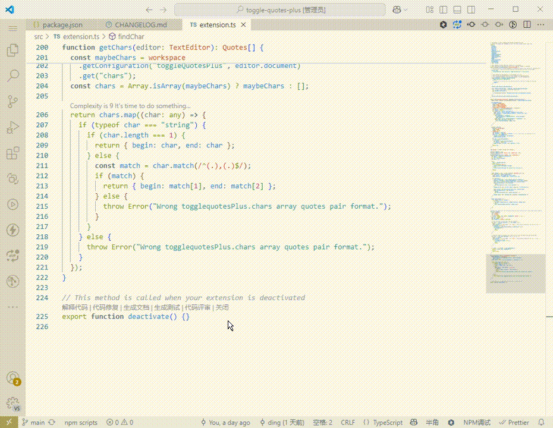

# Run NPM Scripts

A simple yet powerful VS Code extension that helps you quickly view and run npm scripts in your project.

## Features

- 📌 Adds an npm scripts button to VS Code status bar
- 📜 Quick access to all npm scripts defined in package.json
- ⚡ Run npm scripts with a single click
- 🔄 Smart memory of last executed script with priority display

## How to Use

1. Open a project containing package.json in VS Code
2. Look for the "npm scripts" button in the status bar
3. Click the button to open the scripts list
4. Select a script to run, and the extension will execute it in the terminal

## Screenshot

## Installation

Search for "Run NPM Scripts" in the VS Code Extension Marketplace and click install.

## License

MIT
